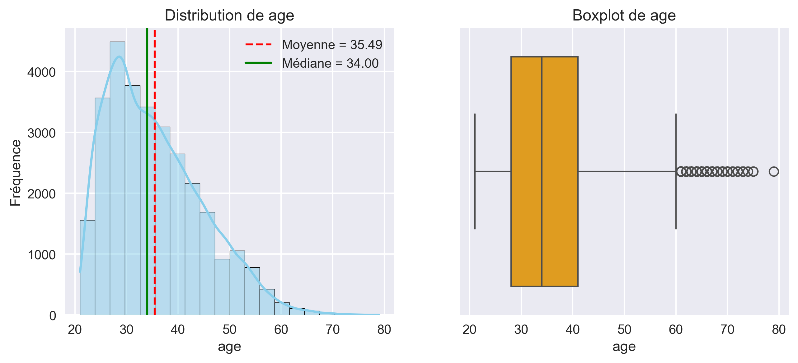

# Analyse du risque de crédit – Défaut de paiement (UA3)

Projet d’analyse exploratoire multivariée visant à identifier les facteurs associés au défaut de paiement
des clients de cartes de crédit à partir du dataset **UCI Credit Card Default**.

---

## 🎯 Objectif et contexte

Les institutions financières cherchent à anticiper le risque de défaut afin de :
- réduire les pertes financières,
- améliorer la gestion du portefeuille client,
- adapter les stratégies de crédit selon les profils de risque.

Ce projet a pour objectif d’explorer les données clients, d’identifier les variables déterminantes du défaut
de paiement et de proposer une segmentation exploitable à l’aide de méthodes statistiques et multivariées.

---

## 📊 Données

- **Source** : UCI Machine Learning Repository – *Default of Credit Card Clients*
- **Lien** : https://archive.ics.uci.edu/dataset/350/default+of+credit+card+clients
- **Taille du dataset** :  
  - 30 000 observations (clients)  
  - 24 variables
- **Variables principales** :
  - Socio-démographiques : sexe, âge, niveau d’éducation, statut matrimonial
  - Comportement de paiement : retards mensuels (`PAY_0` à `PAY_6`)
  - Variables financières : montants facturés (`BILL_AMT1–6`), montants payés (`PAY_AMT1–6`)
  - Variable cible : `default_payment_next_month` (défaut = 1)

---

## 🧪 Méthodologie / Analyse

Le travail a été structuré selon les étapes suivantes :

1. **Nettoyage et préparation des données**
   - Vérification des types de données
   - Contrôle des incohérences et valeurs aberrantes
   - Standardisation des variables numériques
   - Transformation des variables catégorielles pour les analyses factorielles

2. **Analyse exploratoire**
   - Analyse univariée (distributions, statistiques descriptives)
   - Analyse bivariée (relations avec la variable cible)

3. **Analyse multivariée**
   - Analyse en Composantes Principales (ACP)
   - Analyse Factorielle des Correspondances (AFC)
   - Analyse des Correspondances Multiples (ACM)

4. **Segmentation**
   - Clustering des clients par K-Means afin d’identifier des profils de risque distincts

---

## 📈 Résultats clés

- L’historique des **retards de paiement** est le facteur le plus déterminant du défaut.
- Les variables sociodémographiques ont une **influence marginale** sur le risque.
- Les montants facturés et payés structurent les comportements financiers mais expliquent peu le défaut.
- Les analyses multivariées (ACP, AFC, ACM) convergent vers une lecture comportementale du risque.
- Le clustering permet d’identifier des groupes de clients à **faible risque**, **risque modéré** et **haut risque**.

---

## 🖼️ Visuels – distributions et valeurs aberrantes

Les figures ci-dessous illustrent, pour chaque variable numérique, la distribution des valeurs
(histogrammes avec densité) ainsi que la détection des valeurs aberrantes à l’aide de boxplots.

---

## 🛠️ Technologies utilisées

- Python
- pandas
- numpy
- matplotlib
- seaborn
- scikit-learn
- Jupyter Notebook

---

## 👤 Auteurs

Projet réalisé en équipe dans le cadre du cours **Exploration des données (UA3)**.

- **Thierry Pascal Zokou Tchokonthe**  
  GitHub : https://github.com/tzokou  
  LinkedIn : https://www.linkedin.com/in/thierry-pascal-zokou-tchokonthe-b46655184/

- Angèle Blandine Feussi Nguemkam  
- Willy Stanlin Taguedong  
- Sorel Aniel Fotsing Mba

---

## 📌 Perspectives

Ce travail constitue une base solide pour :
- le développement d’un modèle prédictif de scoring crédit,
- l’automatisation de la segmentation des clients,
- l’aide à la décision pour la gestion du risque de crédit.
